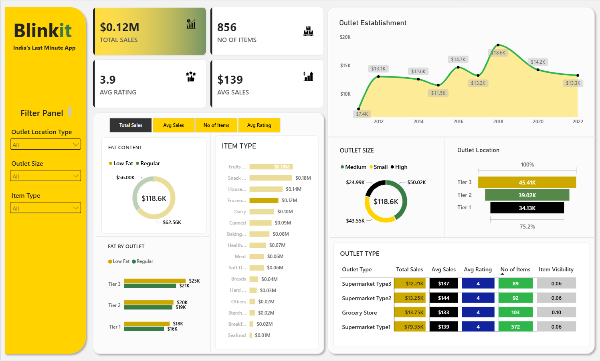

# Blinkit Sales Dashboard - Power BI

An interactive **Power BI sales analytics dashboard** built using the BlinkIT grocery dataset.  
The project analyzes overall sales performance, product categories, outlet characteristics, customer ratings, and location-wise trends to turn raw retail data into actionable business insights.

> **Disclaimer:** This project is created strictly for **educational and portfolio purposes only**. It is **not affiliated with, endorsed by, sponsored by, or officially associated with Blinkit** in any way. The dataset and dashboard are used solely to demonstrate Power BI, data analysis, and data visualization skills.

## Dashboard Preview



> Save your dashboard screenshot inside the `Images` folder with the name `blinkit-dashboard.png`.

## Project Objective

The objective of this project is to analyze BlinkIT grocery sales data and answer key business questions such as:

- Which product categories generate the most sales?
- Which outlet types and locations perform best?
- How does outlet size influence sales?
- How are sales distributed between Low Fat and Regular products?
- How has outlet performance changed across establishment years?
- What opportunities can be identified for improving sales and customer experience?

## Key Performance Indicators

| KPI | Value |
|---|---:|
| **Total Sales** | **$1.20M** |
| **Average Sales** | **$141** |
| **Number of Items** | **8,523** |
| **Average Rating** | **3.9 / 5** |

## Key Insights

### Product Performance
- **Low Fat products** contribute approximately **$776K (~64.6%)** of total sales, compared with about **$425K (~35.4%)** from Regular products.
- **Fruits & Vegetables** and **Snack Foods** are the leading item categories, each generating roughly **$0.18M** in sales.
- **Household**, **Frozen Foods**, and **Dairy** are also major revenue-contributing categories.

### Outlet Performance
- **Supermarket Type 1** is the strongest outlet type, generating approximately **$787.6K** in sales - around two-thirds of total revenue.
- **Medium-sized outlets** contribute the highest sales at roughly **$507.9K (42.3%)**.
- **Tier 3 locations** lead geographic performance with approximately **$472.1K** in sales, ahead of Tier 2 and Tier 1 locations.

### Sales Trend
- Sales by outlet establishment year show noticeable variation, with **2018 recording the highest sales level at about $205K**.
- The pattern suggests that outlet maturity, location strategy, and store format may materially influence sales performance.

### Customer Experience
- The overall average rating is approximately **3.9/5**, indicating generally positive customer satisfaction with room for improvement.

## Business Recommendations

- Prioritize inventory availability for high-performing categories such as **Fruits & Vegetables** and **Snack Foods**.
- Study the operating model of **Supermarket Type 1** outlets and apply successful practices to weaker outlet formats.
- Investigate why **Tier 3 locations** outperform Tier 1 and Tier 2 locations and use those findings for expansion planning.
- Maintain a strong assortment of **Low Fat products**, which represent the majority of sales in this dataset.
- Analyze the drivers behind the **2018 sales peak** to identify repeatable growth factors.
- Improve customer experience initiatives with the goal of moving the average rating above **4.0**.

## Dashboard Features

- KPI cards for Total Sales, Average Sales, Number of Items, and Average Rating
- Sales analysis by Item Fat Content
- Sales analysis by Item Type
- Outlet Establishment Year trend
- Outlet Size analysis
- Outlet Location analysis
- Outlet Type comparison
- Interactive slicers and filters

## Tools & Technologies

- **Power BI Desktop** - Dashboard development and visualization
- **Power Query** - Data cleaning and transformation
- **DAX** - KPI and business metric calculations
- **Microsoft Excel** - Source dataset
- **PBIP** - Source-control-friendly Power BI project format

## Repository Structure

```text
blinkit-sales-dashboard/
|
|-- Dashboard.Report/              # Power BI report definition
|-- Dashboard.SemanticModel/       # Semantic model and calculations
|-- Images/                        # Dashboard screenshots/assets
|   `-- blinkit-dashboard.png      # Final dashboard preview
|-- BlinkIT Grocery Data.xlsx      # Source dataset
|-- Dashboard.pbip                 # Power BI project file
|-- background kpi.png             # Dashboard design asset
|-- Blinkit_Key_Insights_Report.pdf
|-- .gitignore
`-- README.md
```

## How to Open the Project

1. Clone the repository:
   ```bash
   git clone https://github.com/BoGeYmAn04/blinkit-sales-dashboard.git
   ```
2. Open `Dashboard.pbip` using **Power BI Desktop**.
3. If Power BI asks for the dataset location, point it to `BlinkIT Grocery Data.xlsx`.
4. Refresh the data and use the dashboard slicers to explore the analysis.

## Key Learning Outcomes

This project demonstrates practical experience in:

- Data cleaning and transformation
- KPI development using DAX
- Retail sales analysis
- Interactive dashboard design
- Business insight generation
- Data storytelling
- Version-controlling Power BI projects with PBIP

## Author

**BoGeYmAn04**

GitHub: [BoGeYmAn04](https://github.com/BoGeYmAn04)

---

If you found this project useful, feel free to star the repository.
